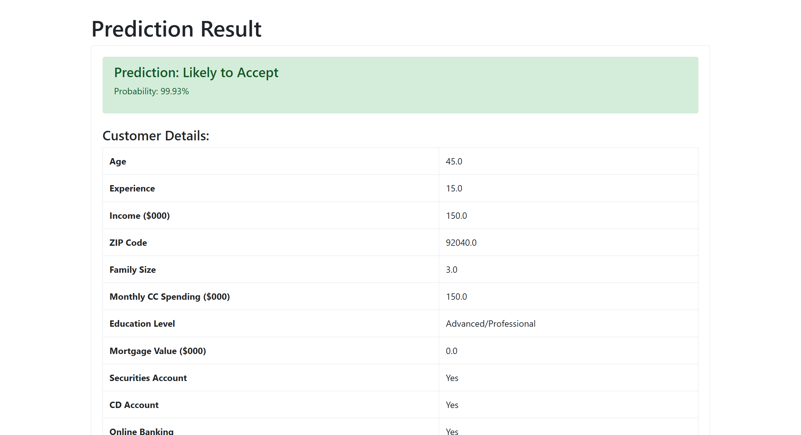

# 🛍️ Customer Segmentation Analysis Web Application

## 📌 Overview

In this project, we aim to develop a classification model for predicting personal loan acceptance using the Thera-Bank dataset. Most Thera-Bank customers are depositors, with a relatively small segment being borrowers (asset customers). The bank seeks to grow this borrower base to boost its loan business and increase interest revenue. Specifically, management is focused on converting liability customers into retail loan customers without losing them as depositors.

## 🚀 Problem

The goal is to help the bank identify customers who are more likely to take a loan, enhancing the effectiveness of marketing campaigns and improving conversion rates. A key challenge with this dataset is its class imbalance, which can skew predictions toward the majority class. To address this, we implemented techniques to balance the data and ensure equitable representation of both classes  

---

### Demo Video

# 📊 Exploring and Preprocessing Data

- Conducted in-depth data exploration and cleaning.
- Addressed class imbalance through various resampling techniques to ensure fair representation of both classes.
- Engineered features and prepared the dataset for robust modeling.

---

## 🤖 Model Building

A wide range of classification models were implemented, particularly focusing on penalized and tree-based algorithms:

- **Complement Naive Bayes**
- **Bernoulli Naive Bayes**
- **Logistic Regression**
- **Decision Tree**
- **K-Nearest Neighbors**
- **Support Vector Machine (SVM)**
- **Random Forest**
- **AdaBoost**
- **Gradient Boosting**
- **Extra Trees**
- **XGBoost**

---

## 📈 Evaluation

Models were assessed using metrics tailored for imbalanced datasets:

- **F1-score**
- **Precision**
- **Recall**
- **AUC-ROC (Area Under the Receiver Operating Characteristic Curve)**

These metrics helped ensure that model performance wasn't biased toward the majority class and provided a more holistic view of predictive power.
